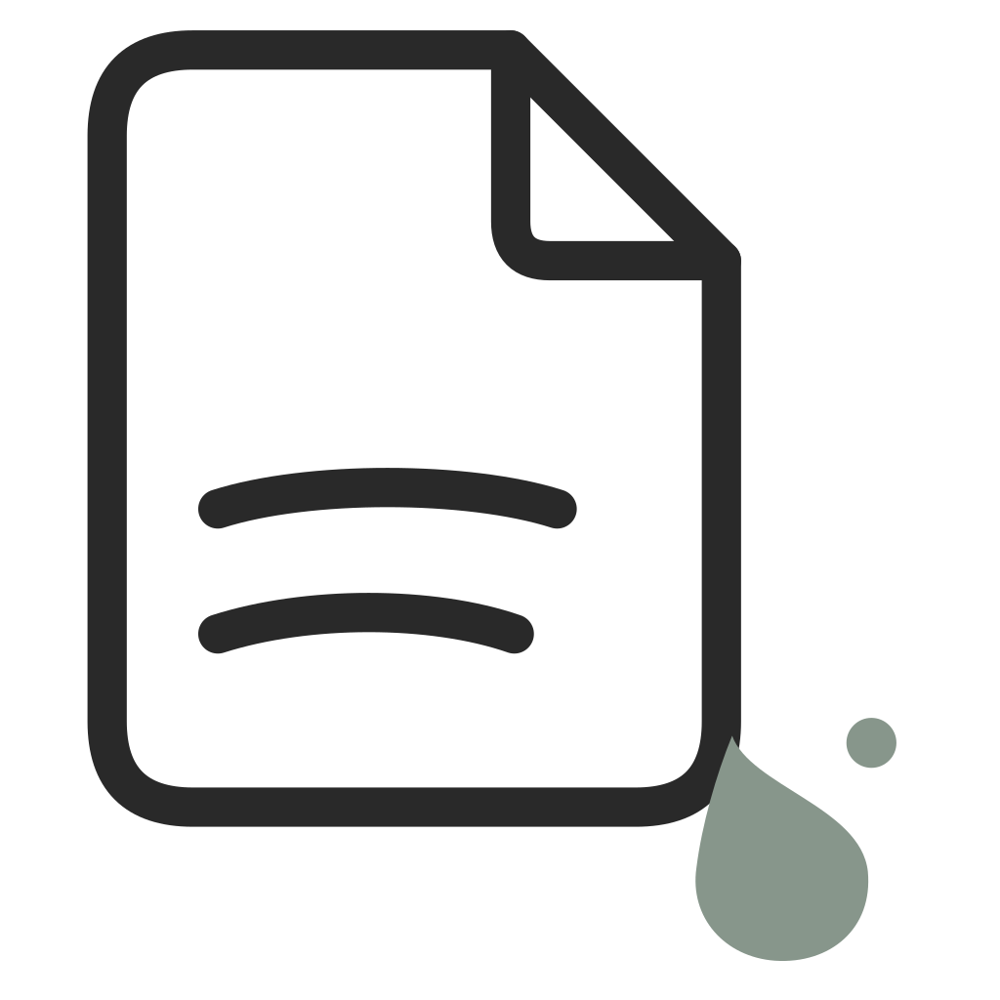

<p align="center"></p>
<h1 align="center">拾笺 InkJian</h1>
<p align="center">拾起日常，落墨成笺。</p>

拾笺是本地 Markdown 写作与博客管理桌面应用。应用管理文章、图片、配置、模板、本地预览和 GitHub Pages 发布；网站模板负责展示。用户内容保存在自己选择的目录中。

[下载应用](https://github.com/zhoujiakang/blog_studio/releases/latest) · [模板开发指南](template/DEVELOPMENT.md) · [模板目录说明](template/README.md) · [MIT 许可](LICENSE)

## 使用范围

当前实现只支持 macOS，工程最低系统版本为 macOS 12。Windows 平台实现尚未完成。应用没有云同步、自动更新或已安装模板的自动更新。

普通用户不需要 Flutter、Xcode 或 Git。预览和发布需要 Node.js/npm：应用优先使用符合模板要求的系统安装；缺失或版本不适合时，可按提示下载官方便携运行组件。第一次使用模板时，应用提示安装网站依赖。首次下载需要网络，准备完成后的本地写作和预览可离线进行。

安装 DMG 时，将 `InkJian.app` 拖到 Applications。能否直接通过 macOS 安全检查取决于安装包的签名与公证；没有 Developer ID 签名和公证的包可能需要在系统设置中允许打开。

## 日常使用

1. 选择空目录创建博客，或打开当前格式的已有博客。初始化从 GitHub 下载网站模板，不下载应用源码。
2. 新建文章或小记。编辑器输入 Markdown 语法并实时渲染；文章最初保存为草稿，可转为正式文章。内容自动保存，也可手动保存。
3. 编辑标题、日期、摘要、标签、分类和封面；使用搜索、筛选、分类树和回收区管理内容。
4. 编辑关于页、通用配置和主题配置。图片可通过选择文件、剪贴板和 Finder 拖放导入。
5. 点击“浏览本地博客”，按提示准备运行组件和依赖，随后在浏览器中预览。
6. 发布时连接 GitHub、授权专用公开仓库，应用构建当前模板并上传静态网站到 GitHub Pages。

## 博客目录与数据

这是应用创建的用户目录，和本仓库不是同一个项目目录。

```text
my-blog/
├── blog.json                 # 通用配置、活动模板、发布目标与状态
├── resource/                 # 所有模板共用的用户内容
│   ├── posts/                # 正式文章
│   ├── drafts/               # 草稿
│   ├── notes/                # 小记
│   ├── images/               # 用户导入的图片
│   └── about.md              # 关于正文
└── template/
    ├── butterfly/            # 网站代码及该主题的配置
    └── 其他模板/
```

使用过程中还会生成 `.blog-studio/`，保存备份、回收记录和标签/分类置顶偏好。这些是应用管理状态，不是公开内容。

- 博客格式为 `blog.json.formatVersion = 2`，不迁移其他格式。
- `blog.json.activeTemplate` 指定当前网站模板，`site` 保存名称、副标题、作者、简介和头像。
- 各主题的 `template.json` 保存自己的字段定义、默认值与当前值。应用支持文字、图片、颜色三个配置类型。
- 文章是带 YAML Front Matter 的 Markdown 文件。标签和分类是文章属性，应用扫描后汇总为内存索引，不维护独立标签数据库。
- `categories: ["技术/Flutter"]` 表示父子分类；两个数组元素表示两个独立分类。
- 草稿和小记不进入网站；关于页单独渲染，不计入文章或标签统计。
- 当前模板只使用显式 `description` 作为摘要；为空时隐藏，不从标题或正文生成摘要。
- 图片保存在 `resource/images/`，内容和配置引用 `/img/文件名`。应用导入支持 PNG、JPEG、GIF、WebP，保留原始图片；限制为 40 MiB、3200 万像素、单边 16384 像素。
- 新博客的文章、草稿、小记和图片目录为空，应用只创建默认关于页。切换主题不复制或移动内容。

## 架构与模块联系

```text
桌面应用
├── 界面与控制器：接收操作、显示状态
├── 业务服务：写作、索引、配置、模板、预览、发布
├── 存储：Markdown、JSON、图片、备份与回收
├── 编辑器：Flutter 宿主与 Milkdown 网页编辑器
└── 平台适配：窗口、文件选择、拖放、凭证与进程
        │ 管理资源、配置和模板；启动或构建网站
        ▼
用户博客
├── blog.json ──────────────→ 指定当前模板，提供通用信息
├── resource/ ──────────────→ 保存与样式无关的内容
└── template/<id>/ ─────────→ 读取公开内容与配置，渲染网站
                                  │
                                  ▼
                       本地预览 / 静态网站 → GitHub Pages
```

产品由应用块和博客块组成；博客块包含共享资源和网站模板。源码按语言、工具链和职责组织，不要求把产品模块机械地映射成目录。

| 源码路径 | 职责与联系 |
| --- | --- |
| `lib/main.dart`、`lib/app.dart`、`lib/app/` | 入口、视觉品牌、版本、依赖组装及平台选择 |
| `lib/ui/` | 页面、组件、弹窗和视觉主题，监听状态并接收用户操作 |
| `lib/controllers/` | 导航、筛选、交互提示、编辑器桥接和发布协调 |
| `lib/services/` | 编辑保存、文章索引、配置会话、搜索、模板安装、环境准备和预览 |
| `lib/services/publishing/` | GitHub 登录、构建、公开产物筛选、提交与部署确认 |
| `lib/storage/` | 文章与配置读写、图片导入、路径约束、外部修改检测、备份和回收 |
| `lib/models/` | 各层交换的数据、状态及编辑器接口，不持有文件操作服务 |
| `lib/platform/contracts/` | 系统能力接口 |
| `lib/platform/shared/`、`lib/platform/macos/` | 通用插件封装与 macOS 实现，由应用入口组装 |
| `macos/` | Flutter macOS 宿主、Swift 桥接、权限及 Xcode 工程输入 |
| `integrations/editor/` | Milkdown/Crepe 编辑器、Markdown 保留与 Dart 通信源码 |
| `integrations/preview/` | Node 辅助脚本，安装依赖、管理预览进程、执行构建 |
| `template/<id>/` | 可分发的网站模板源码，读取用户博客的公开资源 |
| `assets/brand/` | 品牌素材输入 |
| `assets/generated/template-manifest.json` | GitHub 模板下载清单及文件校验信息 |
| `test/`、`integration_test/` | 单元、组件和原生集成测试；fixtures 是测试输入 |
| `tool/` | 源码准备、版本与清单生成、独立测试博客和打包工具 |

`integrations/` 和 `macos/` 都是应用源码，不是独立部署的业务后端。应用没有 Go/Java 服务。Node 辅助进程负责运行网站工具链，模板自己的 HTTP 服务负责本地网页预览。

主要关系是 UI → 控制器 → 业务 → 存储/平台。实际代码中，部分页面直接使用配置或图片存储接口，部分控制器直接协调文件操作。存储层和模型层不依赖业务服务、控制器或页面。`EditorSession` 通过 `DocumentEditor` 接口使用编辑器，网页实现由 `StudioHome` 注入。

### 从操作到结果

- **写作**：网页编辑器发送带会话与修订信息的事件 → Dart 桥接校验 → 编辑会话更新正文 → 延迟 700 ms 自动保存 → 存储层检测冲突并写入 Markdown → 更新单篇内存索引。切换、退出前尝试保存；输入法组合输入期间推迟保存。
- **模板**：读取 GitHub `main` 的模板清单 → 下载选中模板并检查长度和 SHA-256 → 新博客创建空资源目录、关于页和 `blog.json`。已有博客添加模板只新增主题代码，不覆盖资源或通用配置。
- **预览**：检测 Node/npm → 准备依赖 → 根据 `activeTemplate` 找到网站目录 → 执行模板 `dev` 脚本 → 检查本地服务 → 打开浏览器。
- **读取内容**：Butterfly 的 `content.mjs` 从模板目录向上查找 `blog.json` → 读取根目录 `resource/posts/` 和 `about.md` → Vite 提供 `virtual:blog-content` → Vue 渲染。浏览器不直接读取电脑文件。
- **发布**：保存 → 检查授权和目标 → 在隔离目录执行模板 `build` → 检查输入变化和公开产物 → GitHub API 创建提交 → 确认 Pages 部署。

模板源码不打入应用安装包。网页编辑器的构建资源和 Node 辅助脚本随应用分发。编辑器支持常用 Markdown 实时渲染，未支持的 HTML、数学或模板语法等片段以源码块保留；不保证所有语法均按原样实时预览。

## GitHub Pages 发布

当前实现面向个人账号的专用公开仓库，默认分支为 `main`。接受空仓库、仅有 `README.md` 的新仓库，以及此前由该博客初始化的发布仓库；不覆盖其他网站或其他博客的发布目标。

发布只上传静态网站、公开内容引用的图片及应用生成的发布标记和 `.nojekyll`，不直接上传 Markdown、模板源码、草稿、小记、配置、备份或凭证。正式文章和关于正文会包含在静态网站中并公开。使用 `main` 根目录，不创建发布分支或 Actions 工作流，也不依赖本地 Git 命令。

GitHub App 使用 Device flow，令牌保存在 macOS 钥匙串；`blog.json.publish` 只保存发布目标和状态。默认公开标识对应 [InkJian Publisher](https://github.com/apps/inkjian-publisher)，源码不包含 Client secret、私钥或个人令牌。应用权限变更后，用户需要接受新增权限。等待部署超时可继续确认；上传后的取消不会撤销提交。

维护 fork 时可注册自己的 GitHub App，启用 Device flow，配置 Contents、Pages、Administration 读写权限，并设置公开标识：

```sh
flutter run -d macos \
  --dart-define=INKJIAN_GITHUB_CLIENT_ID=你的ClientID \
  --dart-define=INKJIAN_GITHUB_APP_SLUG=你的应用slug
```

打包脚本接受同名环境变量。不要把密钥写进源码或构建参数。

## 开发与构建

在 macOS 准备 Flutter SDK、Xcode 和 Node.js/npm。Dart 约束为 `^3.13.4`；当前 Butterfly 要求 Node.js `>=22.18.0`。依赖以声明和锁文件为准。下列命令从本仓库根目录执行。

```sh
# 恢复依赖，构建网页编辑器，生成版本常量
bash tool/prepare_sources.sh

# 启动桌面应用
flutter run -d macos

# 生成 macOS 安装包
bash tool/package_macos.sh
```

打包版本来自 `pubspec.yaml`。产物位于 `build/macos/Build/Products/Release/InkJian.app` 和 `build/releases/<版本>/`，包含 DMG、ZIP、SHA256SUMS.txt；DMG 包含应用与 Applications 快捷方式。架构后缀根据实际二进制确定。签名、公证使用 `INKJIAN_SIGN_IDENTITY`、`INKJIAN_NOTARY_PROFILE`，证书和凭据不提交。

### 回归检查

完成源码准备后执行：

```sh
flutter analyze
flutter test
(cd integrations/editor && npm test)
(cd template/butterfly && npm ci --ignore-scripts && npm test)
```

真实网站构建测试默认跳过，安装模板依赖后单独执行：

```sh
INKJIAN_TEST_BUILD=1 flutter test test/services/publishing_build_test.dart
```

独立预览博客和原生测试：

```sh
dart run tool/prepare_test_blog.dart --allow-install
node --test integrations/preview/layout.test.mjs integrations/preview/runner.test.mjs integrations/preview/tests.local.mjs
flutter test integration_test/all_native_test.dart -d macos --dart-define="INKJIAN_SOURCE_ROOT=$PWD"
```

夹具不使用真实用户博客；原生测试需要可操作的 macOS 桌面。中文输入法、不同硬件和线上发布仍需实际验证。格式化使用 `dart format lib test integration_test tool`。

## 源码、生成文件与提交范围

提交应用与模板源码、品牌素材、必要说明、LICENSE、依赖声明、锁文件、测试和工具脚本。`doc/` 是本地模块说明，由 `.gitignore` 排除；仓库没有自动构建流程或 Prettier 配置。

| 不提交的内容 | 恢复方式 |
| --- | --- |
| `integrations/editor/node_modules/`、`assets/editor/` | 编辑器安装依赖并构建，准备脚本自动完成 |
| `.dart_tool/`、插件元数据、`lib/app/app_version.dart` | 准备脚本与 Flutter 工具生成 |
| macOS Pods、ephemeral、插件注册文件 | Flutter macOS 构建准备生成 |
| `build/`、`dist/`、DMG、ZIP、缓存 | 按运行或打包流程生成 |
| 用户内容、凭证、签名资料、本地开发记录 | 不作为源码分发 |

`assets/generated/template-manifest.json` 必须提交：它是应用从 GitHub 下载模板所需的分发数据，不是网页编译产物。修改模板后执行 `dart run tool/generate_template_manifest.dart`，模板和清单一起提交到 `main`。已安装模板不会自动被远程版本覆盖。

## 模板扩展与许可

其他 AI 或开发者编写模板时，请完整阅读 [模板开发指南](template/DEVELOPMENT.md)。当前代码要求 Vue 项目入口和兼容的 dev/build 命令；不能仅提供 HTML 截图或让模板自带用户文章。符合规范的本地模板无需修改桌面应用即可识别、预览和构建；出现在官方远程下载列表中还需提交源码并重新生成清单。

自有代码采用 [MIT](LICENSE)。Flutter 与系统插件、Milkdown/Crepe、Vue/Vite、Markdown 解析和清理组件是第三方依赖，不是本项目重写的基础框架。编辑器构建生成第三方许可声明，Flutter 依赖通过框架许可注册保留归属。第三方模板脚本在本机执行，应只使用可信来源。
